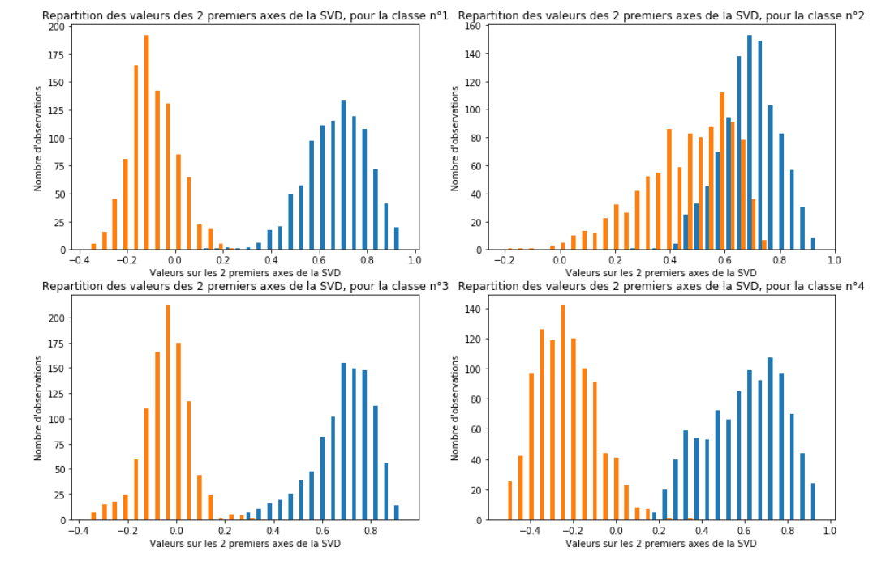
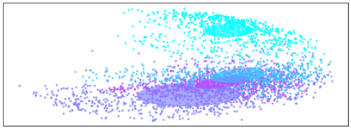
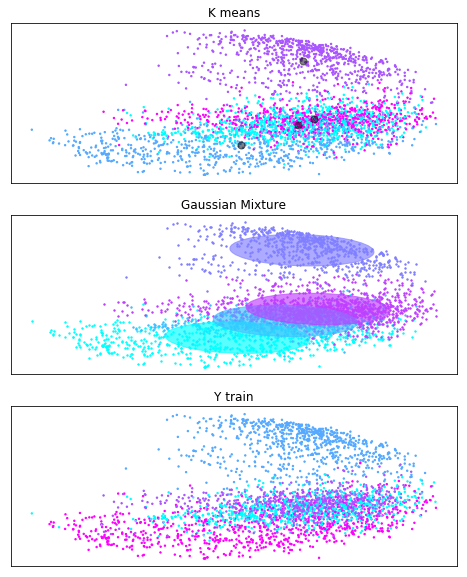

# Catégorisation de textes

#### 1

L'algorithme EM est un algorithme itératif d'estimation paramétrique, les deux
étapes principales sont l'estimation (étape E) de données inconnues à partir de
lois de probabilités connues et paramètres calculés à l'étape M précédente.
L'étape M consiste à modifier les paramètres suivant les données générées afin
de maximiser la vraisemblance.

Cet algorithme peut être décrit par le pseudocode suivant :

```
Soit theta les paramètres d'une fonction de probabilité P
Soit N le nombre d'individus
Soit M le nombre de clusters
Y matrice de taille N, M des y_nm

i = 1
eps = 1e-3
Initialiser theta(i) aléatoirement
convergence = Faux
Tant que (convergence != Vrai):

    # Etape E
    Pour (n, m) allant de (1, 1) à (N, M):
        # calcul des probabilités P(z=m | x) que l'individu n appartiennent
        # au cluster m sachant theta(i)
        y_nm = estimeClusterIndividus(theta(i))
    FinPour

    # Etape M
    # calcul des paramètres, soit theta(i+1) tels que la vraisemblance
    # est maximisée
    theta(i+1) = estimeParametresMaxVraisemblance(Y)

    # Critère d'arrêt
    Si |theta(i) - theta(i+1)| < eps:
        convergence = Vrai
    FinSi

    i = i+1
FinTantQue

y_nm = estimeClusterIndividus(theta(i))
Retourner theta(i)
```

<br>
#### 3

Dans le code fourni, nous avons utilisé *TfidfVectorizer* avec le paramètre **stop_words='english'** afin de ne pas
tenir compte des mots vides tels que [i, me, my, myself, we] fournis par la librairie *NLTK*.

De plus, nous avons appliqué une lemmatisation avec l'outil *SnowballStemmer* de la librairie *NLTK* également.

#### 4

Pour cette étape, nous avons choisi de garder 10 composants pour limiter le problème du *curse of dimensionality* qui
empêcherait de faire des clusters pertinents mais également limiter le risque de perte d'information.

Une normalisation est appliquée sur la matrice obtenue.

#### 5

En considérant 4 clusters, on parvient à obtenir une homogénéité de **0.66** sur l'ensemble X_train et **0.64** sur
X_test avec K-moyennes.

#### 6

Avant d'appliquer l'algorithme EM, nous avons choisi de vérifier la distribution des données.



Les histogrammes ci-dessus représentent la répartition des individus selon leurs deux premiers axes pour chaque cluster.

Elle semblent suivrent un mélange de fonctions de probabilité gaussiennes, ce qui rend donc pertinent l'utilisation de
l'algorithme EM et plus particulièrement la fonction *GaussianMixture* qui permet de déterminer les paramètres
(moyenne, covariance) des 4 fonctions.

Le paramètre **covariance_type='tied'** fait l'hypothèse que les matrices de covariance soient identiques
pour tous les clusters, ce choix est justifié par le fait que 3 clusters sur 4 ont des variances similaires d'après les
histogrammes.

L'homogénéité obtenue avec **covariance_type='full'** (matrices de covariance indépendantes) est plus faible mais
pourrait inversement être justifié par le cluster 2 ayant une variance différente.  



_Note : Les ellipses sont proportionnelles aux matrices de covariances._

En considérant 4 clusters, on parvient à obtenir une homogénéité de **0.64** sur l'ensemble X_train et **0.62** sur
X_test.

<br>
<br>
<br>
<br>
<br>
<br>
#### Conclusion



Dans le comparatif ci-dessus, les points noirs représentent les centroïds des clusters pour l'algorithme des
K-moyennes, les ellipses représentent les covariances des fonctions déterminés par le GMM associés à chaque cluster.

Seuls deux dimensions sont représentées sur les 10 utilisées pour l'apprentissage.

On obtient donc des résultats légèrement meilleurs en apprentissage et en test avec l'algorithme des K-moyennes, cette
différence ne semble pas significative, ce qui peut être expliqué par le fait que les clusters soient globulaires.

En effet, la modification des catégories (['sci.electronics', 'rec.sport.baseball']) rend le GMM légèrement meilleur.

Enfin, en étudiant les mots les plus courants des clusters, on remarque que **edu** et **com** arrivent souvent, qui
correspondent à des adresses mails, non significatives dans la détermination du sujet.

<br>
<br>
<br>
```
Top terms per cluster:
Cluster 0: edu imag file graphic univers line post program use subject
Cluster 1: space nasa edu gov orbit launch henri shuttl com access
Cluster 2: edu game team year player pitch win basebal com hit
Cluster 3: edu use com batteri line ca power like subject write
```
